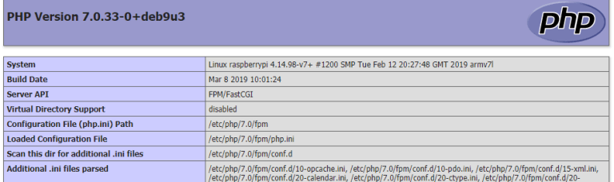
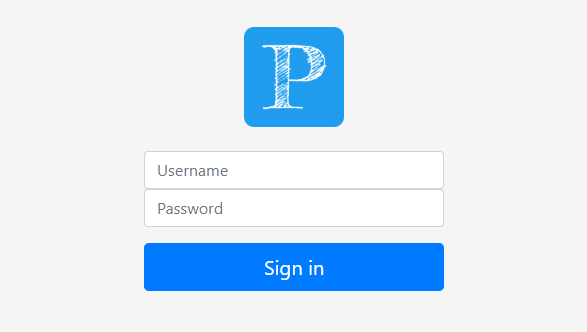

# Local Setup

### **PMPD Installation**

<blockquote>
Sorry, there is no upgrade path from PMPD version 1 to version 2. There
 are just to many changes. Please backup your PMPD directory and
install fresh.
</blockquote>

Download and install Raspbian Buster with desktop onto SD card.
(This is outside the scope of the how-to. If you need help please follow the installation instructions [here](https://www.raspberrypi.org/documentation/installation/installing-images/).)

To enable ssh you will need to create a blank file called ‘ssh’ on the SD Card before installing it into you Raspberry Pi.

To enable wireless and ssh on your Raspberry Pi without a monitor, check out my howto [here](https://www.mattsshack.com/headless-raspbian-setup/).

_**Note:** I recommend changing the default Raspberry Pi password before continuing._

_Install Required software packages:_

    sudo apt update && sudo apt upgrade -y
    sudo apt-get install nginx php-curl php-fpm php-xml php-zip git unclutter -y

_**Note:** **php-zip** has been recently added as a system requirement (v2.7 - Feb. 2021)_

### **Setup PHP with NGINX**

    cd /etc/nginx
    sudo nano sites-enabled/default

- Add `index.php` to line with `index index.html index.htm index.nginx-debian.html;`
    _(Around line 44)_

Scroll Down, uncomment the following lines, and save the file.

    location ~ \.php$ {
      include snippets/fastcgi-php.conf;
      fastcgi_pass unix:/run/php/php7.3-fpm.sock;
    }

Setup PHP information file:

    cd /var/www/html/
    sudo mv index.nginx-debian.html index.php
    sudo nano index.php
- Add `<?php echo phpinfo(); ?>` to top of the file.
- Save file.

Restart / Start NGINX and Test

    sudo /etc/init.d/nginx reload

Opening a browser to http://<ip_address_of_your_raspberry_pi> . If everything is installed correctly. you should see the php information screen similar to this ( PHP 7.3.4-2 has been tested and works ).

Example PHP Info Page:

_Increase NGINX File Size Limitation_

By default NGINX limits the file size you can upload (I think it defaults to 1MB). I recommend increasing the allowed file size so you can upload larger custom images.

    sudo nano /etc/nginx/nginx.conf

- add the follow in the http section after `types_hash_max_size 2048;`\
`client_max_body_size 25M;`

Restart NGINX:

    sudo /etc/init.d/nginx reload

Opening a browser to http://<ip_address_of_your_raspberry_pi> and make sure NGINX is still working properly.

_Increase PHP upload_max_filesize_

    sudo nano /etc/php/7.3/fpm/php.ini

- Change `upload_max_filesize` _(Around line 845)_
`upload_max_filesize = 25M`

- Save File
- Reboot Raspberry Pi (Might not need to reboot, but I had to for change to work).

## Install Plex Movie Poster Display

Get Code from GitHub:

    cd /your_preferred_directory
    sudo git clone https://github.com/MattsShack/Plex-Movie-Poster-Display.git
    cd Plex-Movie-Poster-Display
    sudo git checkout dev
    sudo cp -R * /var/www/html

- You can replace index.php used for in the testing above.

Permissions:

    sudo chmod -R 774 /var/www/html/
    sudo chown -R pi:www-data /var/www/html/

First Time Use:

Open Browser to http://<ip_of_raspberry_pi>/settings/general.php and login with username **_admin_** and password **_password1_**.

Login Page:

## Chromium Kiosk Mode on Startup

**Pre Raspbian Buster**: Create a .desktop file with the correct configuration to hide the mouse pointer (**needs unclutter installed**), start chromium in kiosk mode, and display posters.

    sudo nano /etc/xdg/autostart/chromium.desktop

    - Add the following to the file:

    [Desktop Entry]
    Type=Application
    Exec=/usr/bin/unclutter & /usr/bin/chromium-browser --noerrdialogs --disable-session-crashed-bubble --disable-infobars --kiosk http://IP_ADDRESS_OF_RASPBERRY_PI
    Hidden=false
    X-GNOME-Autostart-enabled=true
    Name[en_US]=AutoChromium
    Name=AutoChromium
    Comment=Start Chromium

- Save File
- Reboot to Test

**Raspbian Buster**: After upgrading to Raspbian Buster I was not able to use the .desktop file method to auto start Chromium. Instead I had to create a directory and file. I am not sure if this method needs unclutter installed so I left it in the instructions.

    mkdir -p /home/pi/.config/lxsession/LXDE-pi/
    nano /home/pi/.config/lxsession/LXDE-pi/autostart

    - Add the following:

    @chromium-browser --kiosk [PMPD IP Address]

- Save File
- Reboot to Test

 ## Raspberry Pi Boot Config Settings -- Use at own risk --

    sudo nano /boot/config.txt

    -Remove black border from around screen. Uncomment:
    disable_overscan=1

    - Rotate Screen 90 Degrees:
    display_rotate=1

    - Remove Raspberry Pi Power Warning:
    avoid_warnings=2

    - Fix color depth on Raspberry Pi:
    framebuffer_depth=32
    framebuffer_ignore_alpha=1

## Description Scrolling Example

